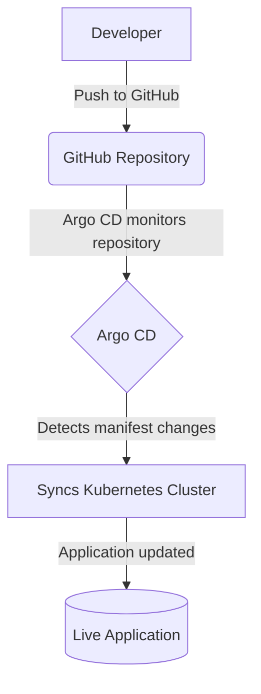

# 🚀 AI Task Processing Platform – Infrastructure & GitOps

This repository contains the Kubernetes infrastructure, deployment manifests, and GitOps configuration for the AI Task Processing Platform.

The infrastructure is designed to deploy the application as a scalable, production-ready Kubernetes workload using Argo CD for continuous delivery and automated synchronization.

## 🏗 Infrastructure Components

This repository includes:

- Kubernetes Deployments
- Services
- ConfigMaps
- Secrets
- Horizontal Pod Autoscalers (HPA)
- Namespace configuration
- Argo CD Application manifest

## 📂 Repository Structure

```text
ai-task-infra/
├── k8s/
│   ├── namespace.yaml
│   ├── configmap.yaml
│   ├── secret.yaml
│   ├── backend.yaml
│   ├── frontend.yaml
│   ├── worker.yaml
│   ├── redis.yaml
│   └── mongo.yaml
│
├── argocd-app.yaml
└── README.md
```

---

## ☸️ GitOps Deployment Workflow

The deployment follows a GitOps workflow.



## 🚀 Deployment

### Prerequisites

- Kubernetes cluster
  - Minikube
  - k3d
  - Docker Desktop Kubernetes
  - Amazon EKS
- kubectl
- Argo CD

### Apply Namespace & Secrets
```bash
kubectl apply -f k8s/namespace.yaml
kubectl apply -f k8s/secret.yaml
```

### Deploy using Argo CD
```bash
kubectl apply -f argocd-app.yaml
```

Argo CD will automatically synchronize all manifests inside the `k8s/` directory.

## 📈 Scaling Strategy

The platform is designed for horizontal scaling.

- Backend replicas: 2–10
- Worker replicas: 2–10
- HPA Target CPU: 70%
- Stateless services
- Redis message queue
- MongoDB persistent storage

The architecture is designed to comfortably support workloads approaching 100,000 tasks/day through asynchronous processing and automatic scaling.

## 🔐 Security

The infrastructure follows several production-oriented practices.

- Secrets separated from application configuration
- ConfigMaps for environment configuration
- Non-root containers (implemented at image level)
- Kubernetes namespaces
- GitOps deployment model


## 🚀 Future Improvements

- KEDA event-driven autoscaling
- Prometheus monitoring
- Grafana dashboards
- Loki centralized logging
- External Secrets Operator
- Cert Manager
- NGINX Ingress Controller
